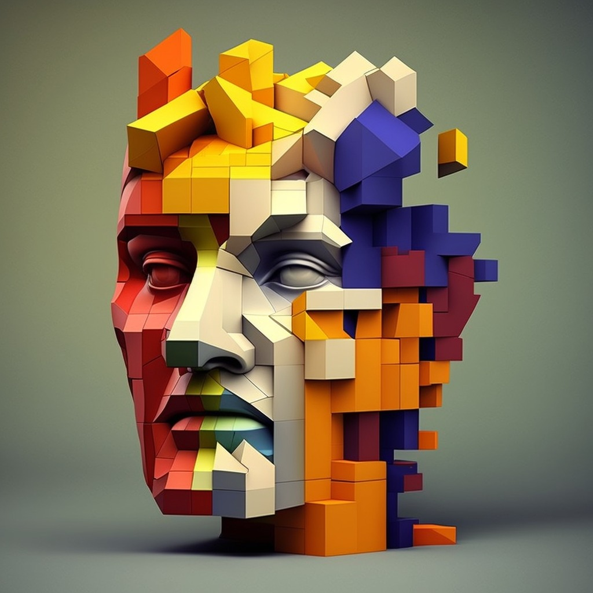

# Face Tetris

## Inspiration
Our team drew inspiration for our hackathon project from a desire to create a fun and engaging user experience that leveraged cutting-edge technology. We were particularly interested in exploring the potential of openCV for detecting facial and hand movements, and we saw an opportunity to apply this technology to create a unique and interactive control mechanism for the game Tetris. Ultimately, our inspiration came from a desire to explore new ideas, learn from our peers, and showcase our creativity and technical skills in a competitive setting.
## What it does
FaceTetris is a new and engaging way to play Tetris that utilizes motion detection and facial recognition technology to allow players to move the blocks with their face or hands. The game adapts to the user's facial features and movements. It's a fun and innovative way to play the classic game!
## How we built it
We built this project using Python's Pygame and OpenCV libraries, along with XML files for hand and face detection. We began by designing the game logic and user interface, and then incorporated different control options for the game. To enable real-time detection on the user's webcam feed, we utilized the trained models and loaded them using the XML files. To enhance the gaming experience, we also added custom music and fonts to Pygame. The result is an engaging and entertaining game that can be enjoyed using different input methods.

## Challenges we ran into
Our team faced several challenges while working on the hackathon project, including oversensitivity and insensitivity issues, random crashes, detecting inanimate objects in the background, and integrating two screens to work together. We had to carefully examine our work, strike a balance, identify and fix the root causes of crashes, develop a mechanism for object detection, and sync and coordinate inputs and outputs between the two screens. Despite these obstacles, we leveraged our collective expertise and creativity to deliver a functional and innovative solution.

## Accomplishments that we're proud of
Our team achieved several accomplishments during the hackathon, which we are proud of. One of the key achievements was successfully implementing the use of openCV to detect face and hand motion, which we leveraged to create an innovative control mechanism for the popular game Tetris. This required us to develop a deep understanding of openCV and integrate it seamlessly into our project, which was a challenging task. We were thrilled to see our efforts come to fruition as we were able to translate facial and hand movements into Tetris movements, resulting in a unique and engaging user experience. Overall, we are proud of our ability to leverage cutting-edge technology and creativity to develop a solution that is both innovative and functional.
## What we learned
Participating in the hackathon was a valuable learning experience for our team. We were able to develop new technical skills, learn from our peers, and gain insights into the design and development process. One of the most important lessons we learned was the importance of collaboration and communication in a team setting. By working closely with one another, we were able to leverage each other's strengths and overcome challenges more effectively. We also learned the value of planning and prioritization, particularly in the context of a time-limited competition. Additionally, we gained a deeper understanding of openCV and its capabilities, which will be useful for future projects. Overall, we are grateful for the opportunity to learn and grow as individuals and as a team during the hackathon.

## What's next for Face Tetris
The future of FaceTetris is looking bright with several exciting features on the horizon. Harder levels will challenge even the most skilled players, while body recognition will open up new possibilities for gameplay. Multiplayer mode will enable players to compete against each other in real-time, adding a new level of excitement and social interaction to the game. Finally, putting the game on a website will make it more accessible to a wider audience and allow players to enjoy FaceTetris from anywhere with an internet connection. With these new features, FaceTetris is set to become even more popular and engaging than ever before. 